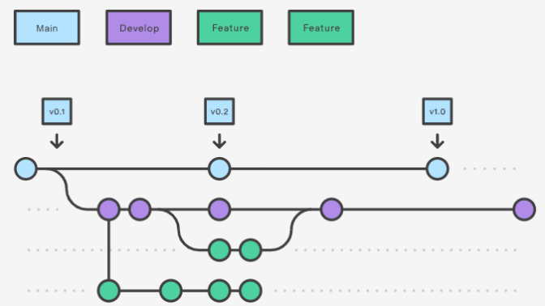

### ✅  Git branch 구조



Feature branch 예시

feature/navbar

featrue/gridSystem (camel style)

<br>

### ✅ Commit Convention

#### 한 번에 git add . 하는 것보다 commit type에 맞게 분리하는 걸 지향합니다.
```
docs : README.md 등 문서 작성 및 수정
code : 코드 작성
fix : 코드 수정
merge : merge request할 때
```
git convention : commit message

<br>

commit message 규칙

한글로 적기, 마지막에 점 안 찍기

무엇을 왜 위주로 적기

<br>

#### ✅ 추가적으로

- 지금까지 나오지 않았던, 다른 사람이 이해하기에 어려울 수 있는 코드에는 친절하게 주석 달아주기

- 1일 1커밋 권장

#### ✅ 작업 후 push하는 방법

 0. git pull origin develop

 1. feature 브랜치 생성  및 이동: git switch -C feature/login

                                git checkout -b feature/signup

 2. 작업 commit 2~3일 몇개 커밋 


 3. 원격으로 올리기
 - git pull 다시 한번 더 하기!!!
 - git push origin feature/login (그래프에 브랜치가 기록됨)


 4. 머지 리퀘스트 작성
 - feature -> develop으로 변경 후 작성


 5. 승인 과 머지 (본인이나 팀원)


 6. 브랜치 삭제
 


