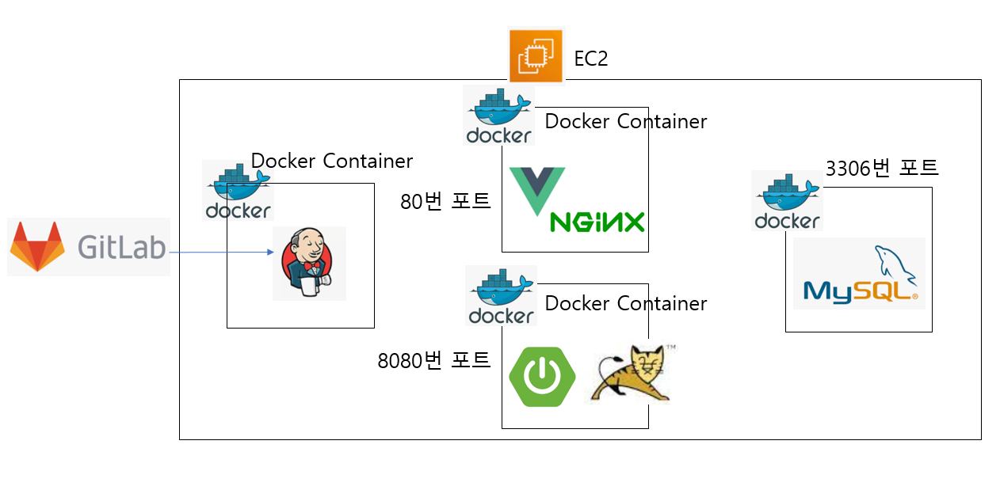
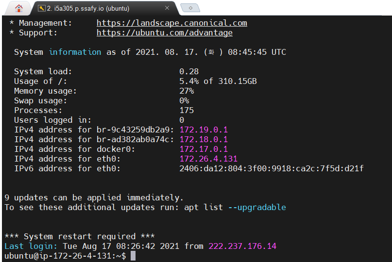
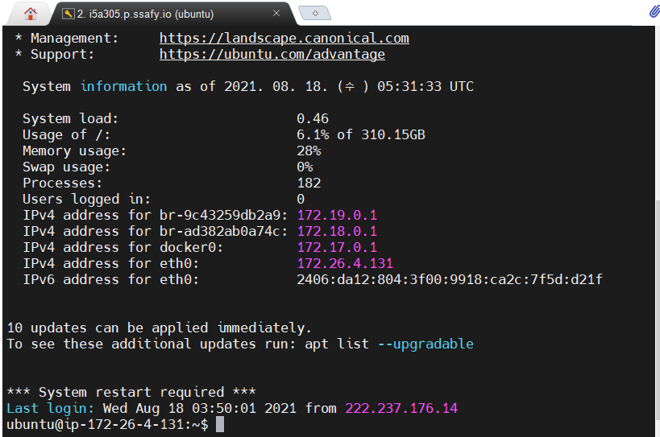
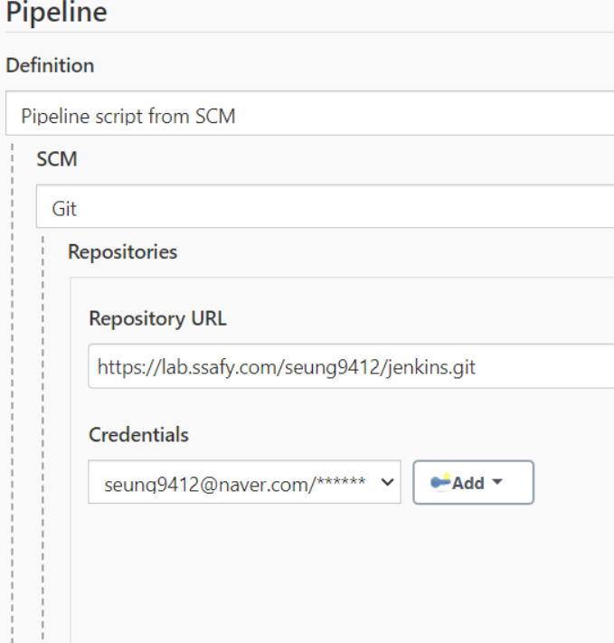
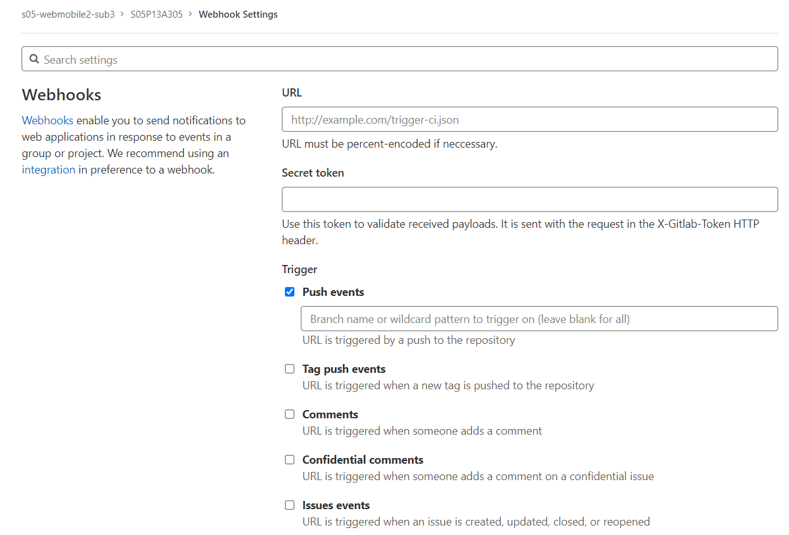
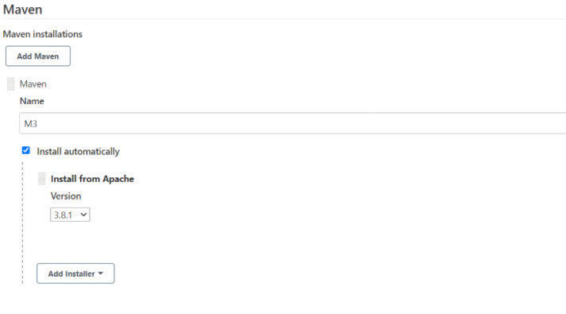

## QweRT porting manual

- 버전

프론트엔드 개발에 사용한 Node.js 14.17.3

프론트엔드에서 사용한 IDE: VS code 1.59.0

백엔드 개발에 사용한 Zulu 8.33.0.1

백엔드에서 사용한 IDE: STS 3.9.13

이를 제외한 버전과 설정 은 도커 파일 등에 구체적으로 적혀있습니다.

그래도 버전을 한 번 미리 언급하면

젠킨스에서 사용하는 Maven은 3.8.1

도커 파일에 있는 node, nginx, java의 도커 이미지는 다음과 같습니다.

```dockerfile
# node
FROM node:lts-alpine as build-stage

# nginx
FROM nginx:stable-alpine as production-stage

# java
FROM openjdk:8-jdk-alpine
```

데이터를 넣으신 후에, 아이디 : ssafy@naver.com 비밀번호: ssafy123

으로 들어가서 웹사이트를 둘러보시거나 직접 회원가입을 하셔도 좋습니다.

<br>

<br>

- 배포한 방법

1. EC2에 도커를 설치하고 젠킨스가 들어있는 컨테이너를 만들었는데 컨테이너 내부에서 도커 명령어를 쓸 수 있도록 설정했습니다.
2. EC2에 MySQL이 들어있는 컨테이너를 만들었습니다.
3.  젠킨스와 프로젝트가 업로드된 깃랩을 웹훅을 통해서 연결했습니다.
4.  프로젝트에 작성한 Jenkinsfile과 Dockerfile을 통해서 자동 배포가 됩니다.

그림으로 나타내면 다음과 같고 4단계를 하나씩 설명하겠습니다.



<br>

<br>

1. EC2에 도커를 설치하고 젠킨스가 들어있는 컨테이너를 만들었는데 컨테이너 내부에서 도커 명령어를 쓸 수 있도록 설정했습니다.

현재 깃랩에 소스코드가 업로드된 상황이라고 생각하고 설명하겠습니다.

먼저, EC2 접속을 위해서 MobaXterm을 설치합니다. 컨설턴트님께 제공받은 pem 파일을 이용해서 EC2에 접속합니다.



이런 화면이 보이면 이제 도커를 설치합니다. 도커 공식 홈페이지 참조했고 명령어는 다음과 같습니다.

```
sudo apt-get update
sudo apt-get install \
    apt-transport-https \
    ca-certificates \
    curl \
    gnupg \
    lsb-release
```

```
curl -fsSL https://download.docker.com/linux/ubuntu/gpg | sudo apt-key add -
```

```
sudo add-apt-repository \
  "deb [arch=amd64] https://download.docker.com/linux/ubuntu \
  $(lsb_release -cs) \
  stable"
```

```
sudo apt-get update
sudo apt-get install docker-ce docker-ce-cli containerd.io
```

설치가 잘 되었는지 확인하기 위해서

```
sudo docker version
```

입력해서 잘 나오면 설치 완료입니다.

docker ps 명령어를 입력했는데 "Got permission denied while trying to connect to the Docker daemon socket" 같은 에러가 나올 경우 해결 방법은 다음과 같습니다.

```
sudo groupadd docker
sudo usermod -aG docker $USER
newgrp docker
```

이제 젠킨스가 들어있는 컨테이너를 만들어야 하는데 컨테이너 내부에서 도커 명령어를 쓸 수 있도록 설정합니다. 이를 위해서

```
sudo apt install docker-compose
```

docker-compose를 설치하고

pwd를 입력했을 때 /home/ubuntu/ 위치에서

docker-compose.yml 만들기

```
FROM jenkins/jenkins
USER $USER
RUN curl -s https://get.docker.com/ | sh
RUN curl -L "https://github.com/docker/compose/releases/download/1.28.5/docker-compose-$(uname -s)-$(uname -m)" -o /usr/local/bin/docker-compose && \
    chmod +x /usr/local/bin/docker-compose && \
    ln -s /usr/local/bin/docker-compose /usr/bin/docker-compose
RUN curl -sL bit.ly/ralf_dcs -o ./dcs && \
    chmod 755 dcs && \
    mv dcs /usr/local/bin/dcs
RUN usermod -aG docker jenkins
```

같은 위치에 Dockerfile도 만든다.

```
version: '3'
services:
  jenkins:
    privileged: true
    build: .
    restart: always
    ports: 
      - "9090:8080"
      - "50000:50000"
    expose:
      - "9090"
      - "50000"
    volumes: 
      - './jenkins_space:/var/jenkins_home'
      - '/var/run/docker.sock:/var/run/docker.sock'
    environment:
      TZ: "Asia/Seoul"
```

그리고 아래의 명령어를 입력하면 1번 과정은 끝이다.

```
docker-compose up -d
```

<br>

<br>

2. EC2에 MySQL이 들어있는 컨테이너를 만들었습니다.

다음의 명령어들을 순서대로 입력합니다.

```
docker run -d -p 3306:3306 --name mysqldb -e MYSQL_ROOT_PASSWORD=root -e MYSQL_PASSWORD=root -e MYSQL_DATABASE=qwertdb -e LC_ALL=C.UTF-8 mysql:8
```

```
docker exec -it mysqldb bash
```

```
mysql -uroot -proot
```

마지막 명령어에서 에러가 날 경우 직접 타이핑해서 입력하시면 됩니다.

```
create user 'ssafy'@'localhost' identified by 'ssafy';
grant all privileges on *.* to 'ssafy'@'localhost' with grant option;
flush privileges;
```

```
use qwertdb;
```

이제 sql문을 넣습니다.

```
-- 기존 DB 삭제 
drop database if exists qwertdb;
create database qwertdb;
use qwertdb;

-- 1. 유저 테이블

-- 기존 유저 테이블 삭제
DROP TABLE IF EXISTS `user`;

CREATE TABLE `user` (
  `user_id` int NOT NULL auto_increment,
  `email` varchar(128) NOT NULL,
  `password` varchar(128) NOT NULL,
  `nickname` varchar(128) NOT NULL,
  `introduction` varchar(1000),
  `profile_img` varchar(256),
  `create_date` datetime DEFAULT current_timestamp(),
  `popularity` int,
  PRIMARY KEY (`user_id`),
  UNIQUE KEY `user_idx_unique_email` (`email`)
);


-- 2. 카테고리 테이블

-- 기존 테이블 삭제
DROP TABLE IF EXISTS category;

-- 테이블 생성
CREATE TABLE category
(
`category_id` INT NOT NULL AUTO_INCREMENT,
`category_name` VARCHAR(45) NOT NULL, 
CONSTRAINT PK_category PRIMARY KEY (category_id)
);

-- 레코드 입력
INSERT INTO `qwertdb`.`category` (`category_name`) 
VALUES 
('동물'), ('사물'), ('풍경'), ('인물'), ('건물'), ('식물'), ('캐릭터'), ('기타');


-- 3. 게시글 테이블

DROP TABLE IF EXISTS posting;

--  게시글 테이블 생성
CREATE TABLE posting
(
`posting_id` INT NOT NULL AUTO_INCREMENT, 
`title` VARCHAR(128) NOT NULL, 
`content` VARCHAR(1000) NOT NULL, 
`posting_img` VARCHAR(256) NOT NULL, 
`create_date` DATETIME DEFAULT current_timestamp(), 
`update_date` DATETIME NULL, 
`masterpiece_flag` bit(1) NULL, 
`user_id` INT NOT NULL, 
`category_id` INT NOT NULL, 
`like_cnt` INT NULL,
PRIMARY KEY (posting_id)
);

ALTER TABLE posting
ADD CONSTRAINT FK_posting_user FOREIGN KEY (user_id) REFERENCES user (user_id);

ALTER TABLE posting
ADD CONSTRAINT FK_posting_category FOREIGN KEY (category_id) REFERENCES category (category_id);


-- 4. 좋아요 테이블 생성

DROP TABLE IF EXISTS `like`;

CREATE TABLE `like`
(
`like_id` INT NOT NULL AUTO_INCREMENT, 
`user_id` INT NOT NULL, 
`posting_id` INT NOT NULL, 
`uploader_id` INT NOT NULL, 
CONSTRAINT PK_like PRIMARY KEY (like_id)
);


ALTER TABLE `like`
ADD CONSTRAINT FK_like_user FOREIGN KEY (user_id) REFERENCES user (user_id);

ALTER TABLE `like`
ADD CONSTRAINT FK_like_posting FOREIGN KEY (posting_id) REFERENCES posting (posting_id);


-- 5. 댓글 테이블 생성

DROP TABLE IF EXISTS `comment`;

CREATE TABLE `comment`
(
`comment_id` INT NOT NULL AUTO_INCREMENT, 
`content` VARCHAR(128) NOT NULL, 
`create_date` DATETIME DEFAULT current_timestamp(), 
`update_date` DATETIME NULL, 
`docent_flag` BIT(1) NULL, 
`user_id` INT NOT NULL, 
`posting_id` INT NOT NULL, 
CONSTRAINT PK_comment PRIMARY KEY (comment_id)
);

ALTER TABLE `comment`
ADD CONSTRAINT FK_comment_posting FOREIGN KEY (posting_id) REFERENCES posting (posting_id);

ALTER TABLE `comment`
ADD CONSTRAINT FK_comment_user FOREIGN KEY (user_id) REFERENCES user (user_id);


-- 6. 큐레이션 테이블 생성
DROP TABLE IF EXISTS curation;

CREATE TABLE curation
(
`curation_id` INT NOT NULL AUTO_INCREMENT, 
`title` VARCHAR(20) NOT NULL, 
`create_date` DATETIME DEFAULT current_timestamp(), 
`content` VARCHAR(100) NOT NULL, 
`thumbnail_img` VARCHAR(256) NULL, 
`color` VARCHAR(45) DEFAULT 'ffffff', 
`user_id` INT NOT NULL, 
CONSTRAINT PK_curation PRIMARY KEY (curation_id)
);


ALTER TABLE curation
ADD CONSTRAINT FK_curation_user FOREIGN KEY (user_id) REFERENCES user (user_id) ;


-- 7. 큐레이션 게이슬 관계 테이블 생성
DROP TABLE IF EXISTS curation_has_posting;

CREATE TABLE curation_has_posting
(
`id` INT NOT NULL AUTO_INCREMENT,
`curation_id` INT NOT NULL, 
`posting_id` INT NOT NULL, 
`curate_date` DATETIME DEFAULT current_timestamp(),
CONSTRAINT PK_curation_and_board PRIMARY KEY (id)
);


ALTER TABLE curation_has_posting
ADD CONSTRAINT FK_curation_has_posting_curation FOREIGN KEY (curation_id) REFERENCES curation (curation_id);

ALTER TABLE curation_has_posting
ADD CONSTRAINT FK_curation_has_posting_posting FOREIGN KEY (posting_id) REFERENCES posting (posting_id);


-- 8. 팔로우 테이블 생성
DROP TABLE IF EXISTS follow;

CREATE TABLE follow
(
`follow_id` INT NOT NULL AUTO_INCREMENT, 
`from_user_id` INT NOT NULL, 
`to_user_id` INT NOT NULL, 
CONSTRAINT PK_follow PRIMARY KEY (follow_id)
);

ALTER TABLE follow
ADD CONSTRAINT FK_follow_from_user FOREIGN KEY (from_user_id) REFERENCES user (user_id);

ALTER TABLE follow
ADD CONSTRAINT FK_follow_to_user FOREIGN KEY (to_user_id) REFERENCES user (user_id);


-- 9. 피드 테이블 생성
DROP TABLE IF EXISTS feed;

CREATE TABLE feed
(
`feed_id` INT NOT NULL AUTO_INCREMENT, 
`create_date` DATETIME DEFAULT current_timestamp(), 
`user_id` INT NOT NULL, 
`posting_id` INT NOT NULL, 
CONSTRAINT PK_feed PRIMARY KEY (feed_id)
);

ALTER TABLE feed
ADD CONSTRAINT FK_feed_user FOREIGN KEY (user_id) REFERENCES user (user_id);

ALTER TABLE feed
ADD CONSTRAINT FK_feed_posting FOREIGN KEY (posting_id) REFERENCES posting (posting_id);

use qwertdb;

```

이제 sql에서 나와서 다시 아래의 화면이 나오도록 합니다.



여기서

```
docker network create springboot-mysql
docker network connect springboot-mysql mysqldb
```

다시 mysql에 들어갑니다.

```
docker exec -it mysqldb bash
```

```
mysql -uroot -proot
```

```
delete from mysql.user where User ='root';
delete from mysql.db where User ='root';
flush privileges;
create user 'root'@'%' identified by 'root';
grant all privileges on *.* to 'root'@'%' with grant option;
flush privileges;
create user 'ssafy'@'%' identified by 'ssafy';
grant all privileges on *.* to 'ssafy'@'%' with grant option;
flush privileges;
```

이제 2번 과정이 완료되었습니다.

<br>

<br>

3. 젠킨스와 프로젝트가 업로드된 깃랩을 웹훅을 통해서 연결했습니다.

EC2의 ip주소 뒤에 :9090을 붙여서 젠킨스에 접속합니다.

로그인을 하고 기본 플러그인을 설치합니다.

젠킨스 관리-플러그인 관리에 들어가서 gitlab을 검색해서 gitlab 플러그인을 설치합니다.

파이프라인을 하나 만들고 파이프라인 탭에서 pipeline script from SCM 선택

SCM 유형에 Git 선택합니다.

현재 프로젝트가 깃랩에 업로드되어 있는데 clone with HTTPS 주소를 복사해서

Repository URL에 붙여넣기합니다.

ScriptPath에는 프로젝트에 있는 젠킨스파일 이름을 똑같이 적어주어야 한다. (대소문자 주의)

그래서 Jenkinsfile을 적습니다.

gitlab의 프로젝트가 private이면 에러가 납니다.

credentials-add-jenkins 누르고 정보를 입력합니다.

username에 깃랩 가입 이메일을 적으면 됩니다.



이런 식으로 나오도록 합니다.

Branches to build에는

*/master을 적습니다.

이제 웹훅을 만들겠습니다.

파이프라인에 Build Triggers를 깃랩으로 설정해주고 옆에 적힌 주소를 복사합니다.

깃랩 프로젝트에 들어가서 왼쪽 탭에서

Settings를 누르고 Webhook를 누릅니다.

URL에 주소를 붙여넣습니다.

다시 젠킨스 페이지로 가서 

고급 누르고 씨크릿 토큰을  generate한 후에

복사해서

깃랩 페이지의 Secret token에 붙여넣습니다.

밑으로 내려가서 Add webhook을 누릅니다.



URL, Secret token을 붙여넣었으면

Push events 밑에 master를 입력합니다.


젠킨스 관리에 들어가서 글로벌 툴 설정을 누르고

Maven을 다음과 같이 설정합니다.



3단계는 이걸로 완료입니다.

<br>

<br>

4. 프로젝트에 작성한 Jenkinsfile과 Dockerfile을 통해서 자동 배포가 됩니다.

Jenkinsfile과 Dockerfile은 다음과 같은데 주의사항이 하나 있습니다.

Jenkinsfile에 이런 내용이 있습니다.

```
sh 'docker rm -f springboot-jar'
sh 'docker rm -f vue-nginx'
```

그런데 처음 빌드를 할 때는 도커에 springboot-jar, vue-nginx 라는 컨테이너가 없기 때문에

처음 master 브랜치에 푸쉬를 할 때는 위의 두 줄을 주석처리하고 푸쉬해주시고

그 다음부터는 주석을 해제해서 푸쉬해주면 됩니다.

이 점만 유의해주시면 됩니다.

참고로 Jenkinsfile과 Dockerfile은 다음과 같습니다. (프로젝트 코드에 있습니다.)

Jenkinsfile

```
pipeline {
	agent any
	tools {
    maven 'M3'
    }
	stages {
		stage('spring-build') { 
			steps {
    			dir('backend') {
      				sh "mvn clean package"
    			}
			}
		}
		stage('spring-deploy') {
			steps {
				script {
					sh 'docker rm -f springboot-jar'
					sh 'docker build -t springboot-container ./backend'
                    sh 'docker run -it -d --name springboot-jar --network springboot-mysql -p 8080:8080 springboot-container bash'
				}
			}  
		}
		stage('vue-build-deploy') {   
            steps { 
				script {
					sh 'docker rm -f vue-nginx' 
					sh 'docker build -t dockerize-vuejs-app ./frontend'
					sh 'docker run --name vue-nginx -d -p 80:80 dockerize-vuejs-app' 
				} 
			}
		} 
	} 
}    
```

<br>

백엔드 쪽 Dockerfile

```dockerfile
FROM openjdk:8-jdk-alpine
COPY target/*.jar app.jar
ENTRYPOINT ["java","-jar","/app.jar"]
```

<br>

프론트엔드 쪽 Dockerfile

```dockerfile
# build stage
FROM node:lts-alpine as build-stage
WORKDIR /app
COPY package*.json ./
RUN npm install
COPY . .
RUN npm run build

# production stage
FROM nginx:stable-alpine as production-stage
COPY ./nginx.conf /etc/nginx/nginx.conf
COPY --from=build-stage /app/dist /usr/share/nginx/html
EXPOSE 80
CMD ["nginx", "-g", "daemon off;"]
```

